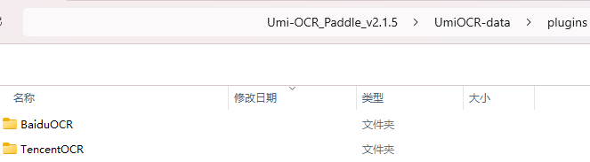
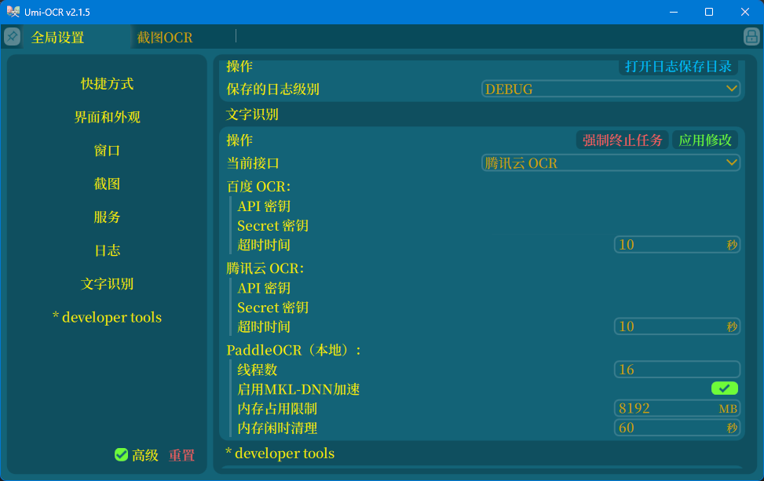
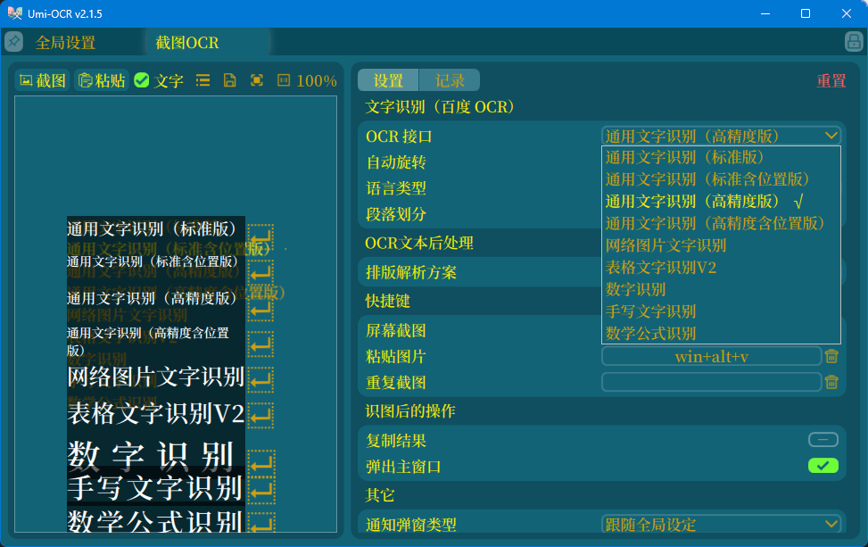

本项目实现了在Umi-OCR中调用腾讯云API和百度云API的功能。

# 使用方法

将`BaiduOCR`文件夹和`TencentOCR`文件夹放到`UmiOCR-data\plugins`路径中即可完成安装

参考[PandaOCRPro](https://www.showdoc.com.cn/PandaOCR/11558472866674591)教程，注册腾讯云和百度云开发者账号，申请 `API 密钥`和 `Secret 密钥`，填写在全局设置中。

# 支持的接口

* TencentOCR
  1. 通用印刷体识别
  2. 通用文字识别(高精度版)
  3. 通用印刷体识别(精简版)
  4. 通用印刷体识别(高速版)
  5. 公式识别
  6. 通用手写体识别
  7. 表格识别(V1)
  8. 表格识别(V2)
  9. 表格识别(V3)
  10. 英文识别
  11. 广告识别

* BaiduOCR
  1. 通用文字识别（标准版）
  2. 通用文字识别（标准含位置版）
  3. 通用文字识别（高精度版）
  4. 通用文字识别（高精度含位置版）
  5. 网络图片文字识别
  6. 表格文字识别V2
  7. 数字识别
  8. 手写文字识别
  9. 数学公式识别

表格识别功能目前不太稳定，bug主要表现在图片尺寸的不兼容，待进一步重构。

# 感谢[Qwen](https://www.tongyi.com/)
